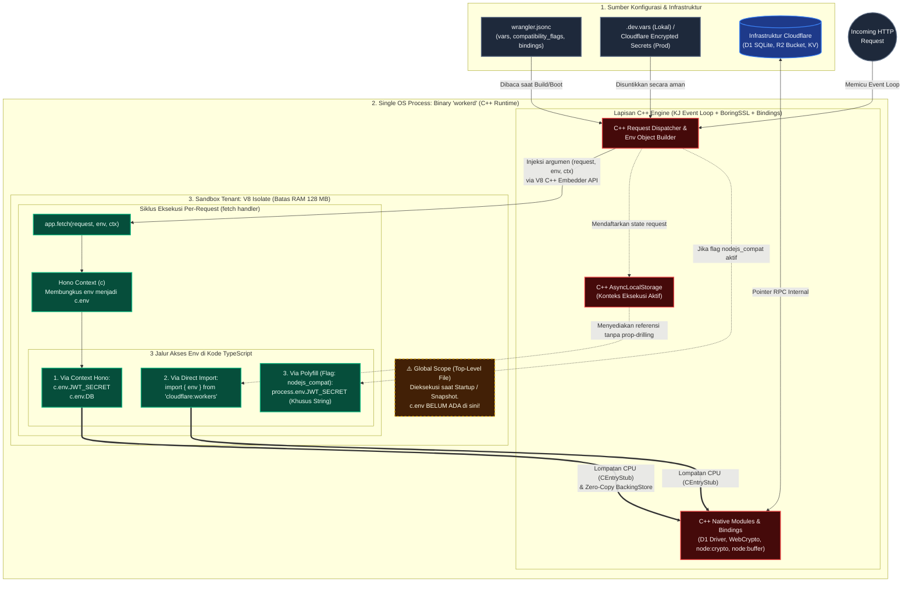

```mermaid
flowchart TB
    %% Styling
    classDef config fill:#1e293b,stroke:#64748b,stroke-width:2px,color:#f8fafc
    classDef cpp fill:#450a0a,stroke:#ef4444,stroke-width:2px,color:#fef2f2
    classDef v8 fill:#064e3b,stroke:#10b981,stroke-width:2px,color:#ecfdf5
    classDef infra fill:#1e3a8a,stroke:#3b82f6,stroke-width:2px,color:#eff6ff
    classDef trap fill:#422006,stroke:#eab308,stroke-width:2px,stroke-dasharray: 5 5,color:#fefce8

    subgraph ConfigSources ["1. Sumber Konfigurasi & Infrastruktur"]
        direction TB
        WConfig["wrangler.jsonc<br/>(vars, compatibility_flags, bindings)"]:::config
        Secrets[".dev.vars (Lokal) /<br/>Cloudflare Encrypted Secrets (Prod)"]:::config
        CFInfra[("Infrastruktur Cloudflare<br/>(D1 SQLite, R2 Bucket, KV)")]:::infra
    end

    HTTPReq(("Incoming HTTP<br/>Request")):::config

    subgraph WorkerdProcess ["2. Single OS Process: Binary 'workerd' (C++ Runtime)"]
        direction TB

        subgraph CppEngine ["Lapisan C++ Engine (KJ Event Loop + BoringSSL + Bindings)"]
            Dispatcher["C++ Request Dispatcher &<br/>Env Object Builder"]:::cpp
            CppBindings["C++ Native Modules & Bindings<br/>(D1 Driver, WebCrypto, node:crypto, node:buffer)"]:::cpp
            ALS["C++ AsyncLocalStorage<br/>(Konteks Eksekusi Aktif)"]:::cpp
        end

        subgraph V8Isolate ["3. Sandbox Tenant: V8 Isolate (Batas RAM 128 MB)"]
            direction TB

            GlobalScope["⚠️ Global Scope (Top-Level File)<br/>Dieksekusi saat Startup / Snapshot.<br/>c.env BELUM ADA di sini!"]:::trap

            subgraph RequestLifecycle ["Siklus Eksekusi Per-Request (fetch handler)"]
                Entrypoint["app.fetch(request, env, ctx)"]:::v8
                HonoCtx["Hono Context (c)<br/>Membungkus env menjadi c.env"]:::v8

                subgraph AccessMethods ["3 Jalur Akses Env di Kode TypeScript"]
                    ViaContext["1. Via Context Hono:<br/>c.env.JWT_SECRET<br/>c.env.DB"]:::v8
                    ViaImport["2. Via Direct Import:<br/>import { env } from 'cloudflare:workers'"]:::v8
                    ViaProcess["3. Via Polyfill (Flag: nodejs_compat):<br/>process.env.JWT_SECRET (Khusus String)"]:::v8
                end
            end
        end
    end

    %% Connections - Config to Dispatcher
    WConfig -->|"Dibaca saat Build/Boot"| Dispatcher
    Secrets -->|"Disuntikkan secara aman"| Dispatcher
    CFInfra <-->|"Pointer RPC Internal"| CppBindings

    %% Connections - Request Flow
    HTTPReq -->|"Memicu Event Loop"| Dispatcher
    Dispatcher -->|"Injeksi argumen (request, env, ctx)<br/>via V8 C++ Embedder API"| Entrypoint
    Dispatcher -.->|"Mendaftarkan state request"| ALS

    %% Connections inside V8
    Entrypoint --> HonoCtx
    HonoCtx --> ViaContext
    ALS -.->|"Menyediakan referensi tanpa prop-drilling"| ViaImport
    Dispatcher -.->|"Jika flag nodejs_compat aktif"| ViaProcess

    %% Connections JS to C++ Bindings
    ViaContext ===>|"Lompatan CPU (CEntryStub)<br/>& Zero-Copy BackingStore"| CppBindings
    ViaImport ===>|"Lompatan CPU (CEntryStub)"| CppBindings
```
